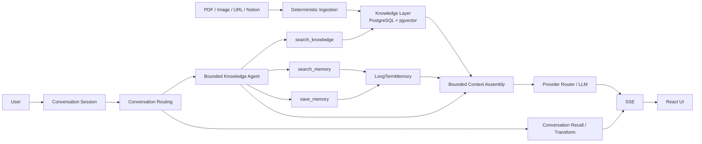

# Knowvia Agent

Enterprise Knowledge Agent for grounded enterprise QA, explicit persistent memory, and bounded tool execution.

Knowvia 將 PDF、Image、Web URL 與 Notion 內容整理成可檢索的 Knowledge Layer，讓 Agent 以 backend-owned evidence 回答問題，再以明確保存的 LongTermMemory 支援跨 session 的 project context。

產品 scope 是單一 bounded Knowledge Agent；Multi-Agent system 與 autonomous agent platform 不在 scope 內。Retrieval、Memory、Notion sync 與 MCP 都是由 backend 控制的 capability、service 或 adapter。

## What Knowvia Does

企業知識通常分散在 PDF、圖片或 screenshot、Web URL 與 Notion page。單純 chatbot 缺少 source grounding、persistent project context、conversation/session boundary，以及受控的 tool execution 與 permission boundary。

Knowvia 將 fragmented enterprise knowledge 與 bounded conversational context 分開管理，形成可重複使用、可追溯的 Agent context。Knowledge evidence、saved memory 與 conversation history 各自保留 authority，不把它們合併成單一 corpus。

## Key Capabilities

### Knowledge

- PDF、Web URL、Image/OCR 與既有 Notion indexing path
- YouTube transcript 與 chat text 目前只建立 `SourceDocument`，不進入 searchable Knowledge QA
- PostgreSQL + pgvector semantic retrieval、relevance acceptance 與 lexical fallback
- backend-owned citations 與 source provenance
- knowledge eligibility 與 relevance acceptance gate
- required Knowledge 無 accepted evidence 時由 backend fail closed

### Conversation

- durable `ConversationSession` 與 `ConversationMessage`
- same-session bounded context 與 New Chat isolation
- per-message citation persistence and disclosure
- conversation recall 與 transform 的 dedicated paths

### Memory

- explicit-save-only `LongTermMemory`
- owner-scoped semantic recall
- user-authoritative `content` 與 derived `retrieval_text` 分離
- Memory Inspector 的 view/delete surface
- `Used saved memory` authority disclosure

### Agent and tools

- single bounded Knowledge Agent
- `search_knowledge`、`search_memory`、`save_memory`
- 每次 run 最多 3 次 tool calls
- allowlist、schema validation、owner scope、timeout、write permission 與 termination control

### MCP

- native stdio protocol boundary
- `initialize`、`tools/list` 與 `tools/call`
- server-side permission boundary，MCP adapter 不放 business logic

### User interface

- React workspace，包含 Knowledge、Chat 與 Memory Inspector
- SSE execution lifecycle 與 progressive answer rendering
- citations、saved-memory disclosure 與 independent pane scrolling

## 架構

目前 runtime 的主要資料與控制流如下。Context Authority Consolidation 已進入 current
implementation；component responsibility 與 authority boundary 請見
[Architecture](docs/01-architecture.md)，細部 contract 請見
[Data and Contracts](docs/02-data-and-contracts.md)。



主要分層是：

- FastAPI routes 負責 transport contract、dependency wiring 與 response mapping。
- Orchestrator 負責 workflow sequencing。
- Service、Repository、Provider Router 與 Tool Registry 負責 deterministic policy、persistence 與外部能力邊界。
- MCP server 只做 protocol mapping，重用既有 allowlisted tool boundary。

## Authority 與安全邊界

| Context | Authority | Disclosure |
| --- | --- | --- |
| `KnowledgeChunk` | enterprise evidence | Sources / citations |
| `LongTermMemory` | explicit saved context | `Used saved memory` |
| Conversation | same-session short-term context | no enterprise citation |

LLM 負責 bounded semantic decisions。Backend 控制 capability 與 authority，包括：

- tool allowlist、schema validation、owner scope 與 write permission
- source eligibility、relevance gate、retrieval execution 與 max tool calls
- citation construction、persistence policy、SSE payload 與 termination

Memory 不能取代缺少的 Knowledge evidence，也不能產生 enterprise document citation。一般 conversation history 只屬於 session context；conversation recall 與 transform 則走各自的 dedicated authority path。

## Request / Agent Flow

```text
User message
  -> conversation routing
  -> bounded Agent or dedicated conversation path
  -> Knowledge / Memory tools when authorized
  -> bounded context assembly
  -> grounded final answer
  -> backend citations or saved-memory disclosure
  -> SSE
```

Explicit memory write 需要使用者明確要求保存。Agent run 的 tool calls 上限是 3；Memory miss 可以 graceful degradation，但 Memory 不會 rescue missing Knowledge。

## 技術棧

| Layer | Technology |
| --- | --- |
| Backend | Python, FastAPI, Pydantic, Uvicorn |
| Database | PostgreSQL, SQLAlchemy, Alembic |
| Vector retrieval | pgvector, cosine similarity |
| Frontend | React, TypeScript, Vite |
| Streaming | SSE |
| Tool protocol | MCP stdio |
| Parsing | pypdf, trafilatura, Pillow, Tesseract |
| LLM / Embeddings | Provider Router abstraction |
| Local runtime | Docker Compose, uv |

## Repository 結構

```text
src/
  agent/              bounded Agent runtime and tool contracts
  app/                FastAPI application and API routes
  orchestrators/      conversation, QA, ingestion workflows
  rag/                chunking, embeddings, retrieval helpers
  repositories/       persistence boundaries
  services/           deterministic policy and domain services
  providers/          LLM and embedding provider adapters
  mcp/                native MCP protocol adapter

frontend/             React workspace
docs/                 product, architecture, contracts, workflows, guardrails
dev_state/            internal development state
eval/                 deterministic Golden Set and runner
scripts/              demo, preflight, and diagnostic tooling
mock_data/            local demo fixtures
```

## Getting Started

Prerequisites：Python 3.10+、`uv`、Docker Compose、Node.js/npm，以及使用 Image/OCR 時的 Tesseract `eng`、`chi_tra`、`chi_sim` languages。Local provider-backed readiness、ingestion、retrieval 與 chat 需要 `OPENAI_API_KEY`。

先建立 environment。`uv run --no-env-file --frozen` 不會自動讀 `.env`，所以要先把設定匯入 process environment：

```bash
uv sync --dev
cp .env.example .env
set -a
source .env
set +a
docker compose up -d postgres
uv run --no-env-file --frozen alembic upgrade head
uv run --no-env-file --frozen uvicorn src.app.main:app --reload
```

Frontend 另開 terminal：

```bash
npm --prefix frontend ci
npm --prefix frontend run dev
```

開啟 `http://127.0.0.1:5173`。Vite 將 `/api` proxy 到 `KNOWVIA_API_BASE_URL`，預設為 `http://127.0.0.1:8000`。`/health` 是 liveness check；`/ready` 檢查 database、migration、pgvector 與 local provider configuration。完整 deployment、configuration、preflight 與 demo flow 請看 [Deployment and Demo](docs/06-deployment-and-demo.md)。

## 測試與 Evaluation

目前有三種主要 verification surface：

1. Automated regression
2. Deterministic Golden Set
3. Browser manual verification

常用 command：

```bash
uv run --no-env-file --frozen pytest -q
uv run --no-env-file --frozen python -m eval.run_agent_eval \
  --report /tmp/knowvia-eval.json
npm --prefix frontend test
npm --prefix frontend run build
```

Golden Set 使用 deterministic scripted provider 與 local fixtures，不需要 live provider、live Notion 或 private source。它是目前的 controlled regression surface，不代表 generic production evaluation framework。Browser manual verification 的步驟與結果已有紀錄。

## Demo

Demo story 會依序展示：

```text
Knowledge source
  -> grounded QA + Sources
  -> explicit memory save
  -> New Chat memory recall
  -> insufficient-info negative case
  -> native MCP tool boundary
```

完整的 5 至 10 分鐘步驟、fallback query、preflight 與 browser checklist 請看 [Deployment and Demo](docs/06-deployment-and-demo.md)。

## Current Status and Known Limitations

### Implemented

- PDF、Image/OCR、URL 與 Notion Knowledge indexing
- durable conversation sessions、same-session context 與 New Chat isolation
- explicit-save `LongTermMemory`、cross-session recall 與 Memory Inspector
- bounded Agent tools、native MCP stdio、SSE 與 React workspace
- backend-owned citations、structured Context Requirement Selection、Reference Binding 與 Evidence Readiness
- deterministic Agent evaluation、read-only demo preflight 與 documented local verification path

### Known Limitations and Deferred Work

- YouTube transcript 與 chat-text generic Knowledge indexing 尚未完成；目前只建立 `SourceDocument`。
- Query-side semantic Memory normalization 與 no-hit / low-confidence second-pass retry 目前 deferred。
- Mixed Knowledge + Memory requests 在部分情境仍有 Evidence Readiness false-negative limitation；後續 semantic-stability work deferred。
- Remote MCP、RBAC 與 provider-native streaming 不在目前 scope。

## 非目標與設計約束

- 不建立 Multi-Agent architecture。
- 不加入 LangChain 或 LangGraph migration。
- 不自動抽取 LongTermMemory；只接受 explicit save。
- 不合併 Knowledge 與 Memory corpus 或 authority。
- 目前 MVP 不重建 BM25、RRF、reranker 或 multi-query retrieval。
- 目前 MVP 不做 remote MCP、RBAC 或 authentication redesign。
- Redis/RQ、Telegram、Supplement、ChangeRequest 與 Notion write-back 不在 Knowvia active execution path。

## 文件入口

- [Product Spec](docs/00-product-spec.md)
- [Architecture](docs/01-architecture.md)
- [Data and Contracts](docs/02-data-and-contracts.md)
- [Workflows](docs/03-workflows.md)
- [Quality and Guardrails](docs/04-quality-and-guardrails.md)
- [Development](docs/05-development.md)
- [Deployment and Demo](docs/06-deployment-and-demo.md)
- [Roadmap](dev_state/PROJECT_ROADMAP.md)
- [Decisions](docs/decisions/DECISIONS.md)

這些文件各自保留 product scope、current architecture、data authority、workflow、quality gate 與 development state。README 是 repository navigation entry，不取代詳細 spec。
