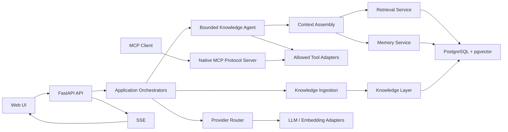

# Knowvia Agent 架構

## 架構邊界

```text
Frontend
  -> FastAPI API
  -> Orchestrator
  -> Service / Provider Router / Tool Registry
  -> Repository 或 External Adapter
```

Route 負責 transport contract、authentication hook、dependency wiring 與
response mapping。Orchestrator 負責 workflow sequencing。Service 負責
deterministic policy。Repository 負責 PostgreSQL access。Provider 與 Tool
adapter 隔離外部能力。



## Component 狀態

| Component | 狀態 | 責任 |
| --- | --- | --- |
| Web App | `IMPLEMENTED` | Knowledge Tab、Chat、Memory Inspector、SSE client |
| FastAPI backend | `EXISTING` | API boundary、auth、dependency wiring |
| Knowledge APIs | `MODIFY` | 將 source ingestion 與 Notion sync 統一成 Knowledge flow |
| Source ingestion | `EXISTING` / `MODIFY` | 現有 parser/persist；補 generic chunk/index |
| Notion sync | `EXISTING` | deterministic page listing、sync、chunk、embed、index |
| Knowledge Layer | `MODIFY` | 統一 `KnowledgeSource`、`SourceDocument`、`KnowledgeChunk` |
| Retrieval Service | `EXISTING` / `MODIFY` | 共用 Notion、PDF、Image、URL 的 pgvector 與 lexical fallback；套用 source eligibility |
| Conversation State | `EXISTING` | durable session、message、owner isolation 與 short-term context budget |
| Context Assembly | `IMPLEMENTED` | 組合 bounded conversation context、Knowledge evidence 與 saved memory |
| Memory Service | `IMPLEMENTED` | explicit save、owner scope、semantic retrieval |
| Bounded Knowledge Agent | `IMPLEMENTED` | 單一 Agent 的有限 tool loop 與 answer generation |
| MCP Tool Layer | `IMPLEMENTED` | native stdio protocol adapter；重用 allowlisted tool registry，不擁有 business logic |
| Provider Layer | `EXISTING` / `MODIFY` | Provider Router、LLM 與 embedding adapters |
| PostgreSQL + pgvector | `EXISTING` / `MODIFY` | durable records、sessions、messages、chunks、vectors 與 memory |
| SSE | `IMPLEMENTED` | browser streaming transport |
| Redis/RQ | `LEGACY` | Telegram worker；不列入 Knowvia MVP core |

## Knowledge ingestion

所有 source 應走同一個 deterministic boundary：

```text
Source adapter
  -> validation
  -> parse
  -> normalize
  -> SourceDocument
  -> chunk
  -> embedding
  -> KnowledgeChunk
  -> retrieval index
```

目前 code 的 PDF、URL 與 Image/OCR flow 都會經過 `SourceDocument`、共用 chunk、
embedding 與 retrieval eligibility。Image/OCR 使用既有 Pillow/Tesseract adapter，
並以 raw image bytes 的 SHA-256 作為 exact duplicate identity；不建立 image-specific
chunk、retriever 或 vector table。Notion flow 也已完成 chunk、embedding 與 indexing；
YouTube 與 chat text 仍在 `SourceDocument` 後停止。URL 仍使用既有 parser adapter，
不建立 source-specific retrieval contract。

## Notion boundary

Notion page listing、page selection、full index 與 incremental sync 都是
deterministic backend operations。LLM 不決定 page id、sync scope 或 eligibility。

Knowvia active path 只讀 Notion。Notion writer、Supplement、ChangeRequest 與
AI Supplement Zone 屬於 inherited LearnLoop legacy，不加入新 Agent runtime。

## Agent runtime

Agent runtime 只建立一個 bounded Knowledge Agent：

```text
User message
  -> load session context
  -> decide whether an allowed tool is needed
  -> validate and run tool
  -> add bounded result to context
  -> answer or run another allowed tool
  -> stop at max iterations / max tool calls
```

初始每次 run 的 tool call 上限為 3。Backend 會檢查 allowlist、schema、timeout、
write permission、memory policy、citation 與 termination。LLM 不得自行取得新
權限或改寫 Agent state。

### Public explicit save

Public conversation 在 backend 產生有效 `ExplicitSaveIntent` 後，直接執行既有的
trusted save path。這條 path 不進 `BoundedAgentRuntime`，也不呼叫 final-answer provider；
`MemoryService` 負責 validation、retrieval representation、embedding、duplicate 與
persistence。`save_memory` tool 保留給 MCP 與其他 tool execution boundary，且仍要求
trusted explicit-save authorization。

Mixed explicit-save 加 substantive task 目前沒有 typed split contract，本 slice 不支援。

## Context Authority Consolidation（5.0.3.3 current implementation）

以下是已 freeze 並完成 implementation 的 replacement architecture。核心原則是：LLM 只做 bounded
semantic interpretation；validation、authority、capability、topology、retrieval execution、
citation、persistence 與 termination 由 backend 擁有。

```text
User message
     │
     ├──────── existing dedicated routes
     │         - explicit save
     │         - conversation recall
     │         - conversation transform
     │         - direct Memory compatibility
     │
     ▼
Structured substantive path
     ▼
Reference Binding
raw bounded conversation history visible ONLY here
     ▼
reference_bindings = [] / [...]
     ▼
Backend validates bindings
     ▼
Task Representation
= exact current user message
+ validated reference bindings
NO rewritten resolved_task
     ▼
Context Requirement Selection
NO raw conversation history
     ▼
Context Acquisition
Knowledge + contextual Memory
     ▼
Current pre-final sufficiency behavior
UNCHANGED in 5.0.3.3
     ▼
Final substantive synthesis
exact current message
+ validated bindings
+ fresh Knowledge
+ fresh Memory
NO incidental raw conversation history
```

`Reference Binding` provider output 只提出 current message 中的 referent 與同 session source
message locator；exact current user input 由 backend 持有，不由 provider 回傳或 rewrite：

```json
{
  "reference_bindings": [
    {
      "current_span": "the second one",
      "source_message_id": "...",
      "source_span": "Deterministic Control Flow"
    }
  ]
}
```

Self-contained request 使用 backend 持有的 exact current user message，`reference_bindings` 為空，
不做自然語言 query rewrite。Incidental raw conversation history 只在 bounded
reference-resolution boundary 可見；它不會成為 Knowledge evidence、Memory authority、citation
或 sufficiency signal。這項限制不套用到明確要求 conversation recall 或 transform 的 dedicated path。

5.0.3.3 已以 backend-validatable bindings 取代 structured selector 的
`conversation_dependency` representation。Current selector 仍保留 `needs_knowledge`、
`needs_memory`、`contextual_facets` 與 `memory_query`；本輪不做 Selector Authority Slimming。
`ContextualFacet` 上限 2、Knowledge/Memory 分離、per-facet Memory resolution signal 與 max 3
tool calls 保持不變；partial 或 zero contextual Memory hit 時，若 Knowledge readiness 通過，
仍可退化為 Knowledge-only 或 partial-personalized synthesis。Malformed decision、provider failure
或超過 tool budget 仍依既有規則 fail closed。

8.6.1 的 current implementation 將 provider wire contract 與 backend domain contract 分離。Provider
使用 strict root object 與 nested `selection` union，backend 再以 deterministic structural mapping
產生既有 `ContextRequirementDecision`。這個 internal DTO 不取得 semantic、authority 或 execution
權限；backend validator、Knowledge/Memory authority、retrieval topology 與 termination control
保持不變。

5.0.3.3 的 architecture implementation 與 automated verification 已完成；unresolved
actual-provider stability probe 與 browser acceptance deferred。這項 stability work 不列為
目前主線；目前下一個唯一主線 priority 是 `8.6.1 Context Requirement Provider Wire Contract`，
automated implementation 已完成，尚待 bounded actual-provider verification。Readiness Usability Study
排在此 slice 後。
`7.0 Evaluation and Demo Hardening` 維持 `manual_verification`，Formal Browser Demo Story
保留但暫排在 `8.6.1` 後。

## Evidence Readiness（8.4 current implementation）

8.4 的 contract 已完成 implementation，structured substantive Agent path 與 `/api/qa`
共用同一個 readiness boundary。Current production retrieval freeze 維持不變：
`PyPDFParserClient / pypdf`、`chunk_max_chars=1200`、`overlap=0`、
`text-embedding-3-small / 1536`、pgvector cosine、`knowledge_relevance_floor=0.30` 與
production `top_k=5`。

Structured substantive current flow：

```text
Current User Task
  -> Reference Binding
  -> Context Requirement Selection
  -> Knowledge / Memory Context Acquisition
  -> Accepted Knowledge Evidence
  -> Evidence Readiness
  -> Backend Gate
  -> Final Synthesis
```

`Evidence Readiness` 只判斷 accepted Knowledge evidence 是否 collectively 足以支撐 current
substantive task 所需的 material Knowledge claims。`accepted_evidence_count > 0` 不等於
`answer ready`。Readiness 位於 accepted Knowledge evidence 與 final synthesis 之間，不新增
second Agent、planner、coverage graph、reranker、query rewrite、multi-query、retrieval retry、
BM25、RRF 或 knowledge graph。

v1 的 production contract 只有：

```json
{
  "ready": true
}
```

Provider 只做 schema-validated semantic readiness judgment。Backend 建立輸入、驗證 schema、
分離 Knowledge 與 Memory authority、執行 gate、產生 citations、處理 insufficient info 與
provider failure，並決定是否進入 final synthesis。`ready=false` 時不呼叫 final synthesis；
provider/runtime failure 不轉成 `insufficient_info`。

Memory 只能提供 authorized supplemental context。LongTermMemory 不會成為 Knowledge evidence，
也不能 rescue missing Knowledge。`contextual_facets` 仍只表示 Memory retrieval dependencies；
backend 以每個 facet 的實際結果計算 bounded `memory_dependencies_resolved` signal，僅供
observability 使用，不參與 Knowledge readiness 或 final-synthesis eligibility，也不改寫成
Knowledge answer requirements。

Dedicated explicit save、conversation recall 與 conversation transform paths 不使用這個
Knowledge readiness gate。前端 user-visible event contract 不新增 readiness event。

## MCP boundary

Native MCP server 只負責 protocol mapping。Local runtime 使用 official Python MCP
SDK 的 stdio transport，對外完成 `initialize`、`tools/list` 與 `tools/call`。Internal
Agent 不經 MCP network self-call，直接使用同一個 `AgentToolRegistry`。

```text
MCP Client
  -> Native MCP stdio server
  -> AgentToolRegistry
  -> Existing tool adapter
  -> Retrieval Service / Memory Service
```

MCP server 不直接讀 raw PostgreSQL 或 Redis，也不放置 business rules。Knowledge
retrieval、memory relevance、owner filtering、citation authority 與 `save_memory`
explicit-save policy 都由既有 tool adapter、Retrieval Service 或 Memory Service
負責。MCP arguments 不能提供 authoritative `owner_id` 或 save authorization。

## Context assembly

本節描述 current implementation。Dedicated conversation recall、conversation transform 與
direct Memory compatibility 保留各自的 history handling；structured substantive path 則依
上方的 Context Authority Consolidation topology 執行。

Context Assembly 分開處理三種資料：

1. dedicated route 或 bounded reference resolver 所需的 session messages，受 token budget 限制。
2. Knowledge evidence，附 source provenance 與 backend citation metadata。
3. LongTermMemory，標示為 saved memory，不當作 enterprise document citation。

KnowledgeChunk 與 LongTermMemory 不能共用 retrieval corpus。

Dedicated recall/transform path 仍由 backend 載入同一 session 的 bounded history；structured
substantive path 僅將 identity-bearing bounded history 傳給 Reference Binding provider，後續
selector、retrieval 與 final provider 不接收 raw transcript。Tool-capable provider 會進入 bounded Agent loop；
不支援 tool calling 的既有 provider fixture 保留原本 QA fallback。Session、message、
title、`updated_at` 與 assistant citation metadata 由 backend persistence 管理。SSE
使用同一 orchestrator 與 persistence path，不改變 Agent policy。

## Provider 與 persistence

LLM 與 embedding 必須經 Provider Router / Provider interface。Database access
必須經 Repository 與 Unit of Work。所有狀態轉移、retrieval eligibility、citation
與 limits 由 deterministic backend 控制。

## Streaming

Backend 以 SSE 發送 bounded execution events、answer delta、citations 與 done。
SSE 是 transport，不改變 Agent 的 permission、tool 或 persistence policy。不得
傳送 private model chain-of-thought。

## 外部系統

| 系統 | Active Knowvia 用途 | 備註 |
| --- | --- | --- |
| PostgreSQL | application state、sessions、messages、KnowledgeChunk、vectors、planned memory | 必要 |
| pgvector | knowledge 與 memory semantic retrieval | 必要 |
| Notion | knowledge source | read/sync only |
| OpenAI 或其他 provider | LLM、embedding | 經 Provider Router |
| MCP server/adapter | allowed tool protocol boundary | Native stdio server implemented；remote server、SSE 與 multi-user auth out of scope |
| Redis/RQ | inherited Telegram queue | Legacy，不是 MVP core |
