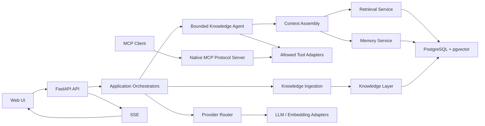

# Knowvia Agent 架構

## 架構邊界

```text
Frontend
  -> FastAPI API
  -> Orchestrator
  -> Service / Provider Router / Tool Registry
  -> Repository 或 External Adapter
```

Route 負責 transport contract、authentication hook、dependency wiring 與
response mapping。Orchestrator 負責 workflow sequencing。Service 負責
deterministic policy。Repository 負責 PostgreSQL access。Provider 與 Tool
adapter 隔離外部能力。



## Component 狀態

| Component | 狀態 | 責任 |
| --- | --- | --- |
| Web App | `NEW` | Knowledge Tab、Chat、Memory Inspector、SSE client |
| FastAPI backend | `EXISTING` | API boundary、auth、dependency wiring |
| Knowledge APIs | `MODIFY` | 將 source ingestion 與 Notion sync 統一成 Knowledge flow |
| Source ingestion | `EXISTING` / `MODIFY` | 現有 parser/persist；補 generic chunk/index |
| Notion sync | `EXISTING` | deterministic page listing、sync、chunk、embed、index |
| Knowledge Layer | `MODIFY` | 統一 `KnowledgeSource`、`SourceDocument`、`KnowledgeChunk` |
| Retrieval Service | `EXISTING` / `MODIFY` | 共用 Notion、PDF、Image、URL 的 pgvector 與 lexical fallback；套用 source eligibility |
| Conversation State | `EXISTING` | durable session、message、owner isolation 與 short-term context budget |
| Context Assembly | `MODIFY` | 在 synchronous QA 中組合 bounded conversation context 與 knowledge evidence |
| Memory Service | `NEW` | explicit save、owner scope、semantic retrieval |
| Bounded Knowledge Agent | `IMPLEMENTED` | 單一 Agent 的有限 tool loop 與 answer generation |
| MCP Tool Layer | `IMPLEMENTED` | native stdio protocol adapter；重用 allowlisted tool registry，不擁有 business logic |
| Provider Layer | `EXISTING` / `MODIFY` | Provider Router、LLM 與 embedding adapters |
| PostgreSQL + pgvector | `EXISTING` | durable records、sessions、messages、chunks、vectors、future memory |
| SSE | `NEW` | browser streaming transport |
| Redis/RQ | `LEGACY` | Telegram worker；不列入 Knowvia MVP core |

## Knowledge ingestion

所有 source 應走同一個 deterministic boundary：

```text
Source adapter
  -> validation
  -> parse
  -> normalize
  -> SourceDocument
  -> chunk
  -> embedding
  -> KnowledgeChunk
  -> retrieval index
```

目前 code 的 PDF、URL 與 Image/OCR flow 都會經過 `SourceDocument`、共用 chunk、
embedding 與 retrieval eligibility。Image/OCR 使用既有 Pillow/Tesseract adapter，
並以 raw image bytes 的 SHA-256 作為 exact duplicate identity；不建立 image-specific
chunk、retriever 或 vector table。Notion flow 也已完成 chunk、embedding 與 indexing；
YouTube 與 chat text 仍在 `SourceDocument` 後停止。URL 仍使用既有 parser adapter，
不建立 source-specific retrieval contract。

## Notion boundary

Notion page listing、page selection、full index 與 incremental sync 都是
deterministic backend operations。LLM 不決定 page id、sync scope 或 eligibility。

Knowvia active path 只讀 Notion。Notion writer、Supplement、ChangeRequest 與
AI Supplement Zone 屬於 inherited LearnLoop legacy，不加入新 Agent runtime。

## Agent runtime

Agent runtime 只建立一個 bounded Knowledge Agent：

```text
User message
  -> load session context
  -> decide whether an allowed tool is needed
  -> validate and run tool
  -> add bounded result to context
  -> answer or run another allowed tool
  -> stop at max iterations / max tool calls
```

初始每次 run 的 tool call 上限為 3。Backend 會檢查 allowlist、schema、timeout、
write permission、memory policy、citation 與 termination。LLM 不得自行取得新
權限或改寫 Agent state。

## MCP boundary

Native MCP server 只負責 protocol mapping。Local runtime 使用 official Python MCP
SDK 的 stdio transport，對外完成 `initialize`、`tools/list` 與 `tools/call`。Internal
Agent 不經 MCP network self-call，直接使用同一個 `AgentToolRegistry`。

```text
MCP Client
  -> Native MCP stdio server
  -> AgentToolRegistry
  -> Existing tool adapter
  -> Retrieval Service / Memory Service
```

MCP server 不直接讀 raw PostgreSQL 或 Redis，也不放置 business rules。Knowledge
retrieval、memory relevance、owner filtering、citation authority 與 `save_memory`
explicit-save policy 都由既有 tool adapter、Retrieval Service 或 Memory Service
負責。MCP arguments 不能提供 authoritative `owner_id` 或 save authorization。

## Context assembly

Context Assembly 分開處理三種資料：

1. session 最近 6 則 messages，受 token budget 限制。
2. Knowledge evidence，附 source provenance 與 backend citation metadata。
3. LongTermMemory，標示為 saved memory，不當作 enterprise document citation。

KnowledgeChunk 與 LongTermMemory 不能共用 retrieval corpus。

3.0 的 current path 仍由 backend 載入同一 session 的 bounded history，將最近 6 則
messages 與 token budget 傳入 synchronous request。Tool-capable provider 會進入 bounded
Agent loop；不支援 tool calling 的既有 provider fixture 保留原本 QA fallback。Session、
message、title、`updated_at` 與 assistant citation metadata 由 backend persistence 管理，
SSE 仍屬 6.0。

## Provider 與 persistence

LLM 與 embedding 必須經 Provider Router / Provider interface。Database access
必須經 Repository 與 Unit of Work。所有狀態轉移、retrieval eligibility、citation
與 limits 由 deterministic backend 控制。

## Streaming

Backend 以 SSE 發送 bounded execution events、answer delta、citations 與 done。
SSE 是 transport，不改變 Agent 的 permission、tool 或 persistence policy。不得
傳送 private model chain-of-thought。

## 外部系統

| 系統 | Active Knowvia 用途 | 備註 |
| --- | --- | --- |
| PostgreSQL | application state、sessions、messages、KnowledgeChunk、vectors、planned memory | 必要 |
| pgvector | knowledge 與 memory semantic retrieval | 必要 |
| Notion | knowledge source | read/sync only |
| OpenAI 或其他 provider | LLM、embedding | 經 Provider Router |
| MCP server/adapter | allowed tool protocol boundary | Native stdio server implemented；remote server、SSE 與 multi-user auth out of scope |
| Redis/RQ | inherited Telegram queue | Legacy，不是 MVP core |
